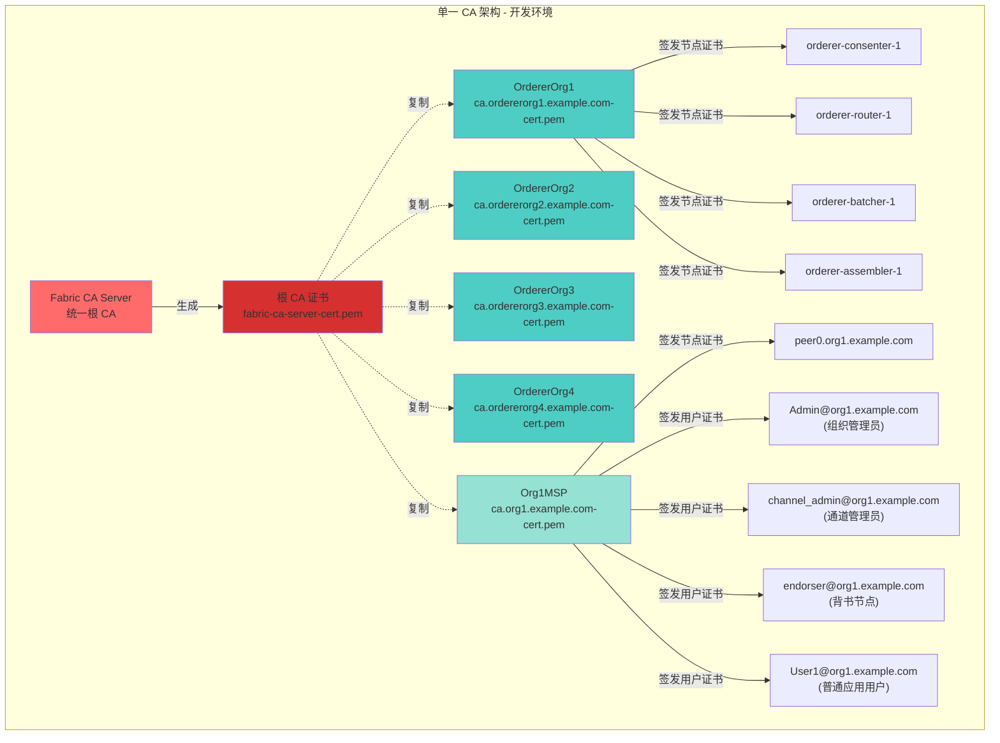
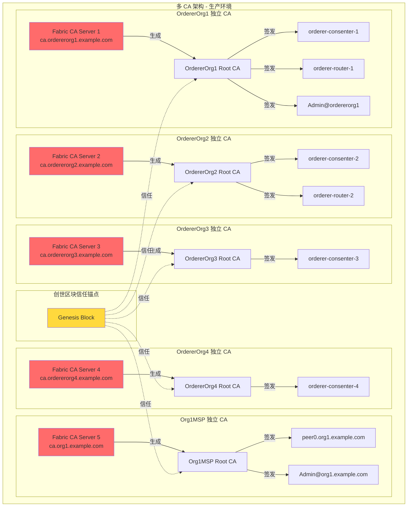
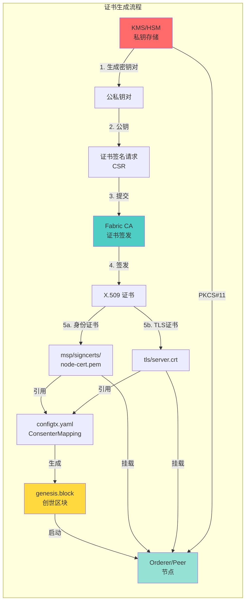
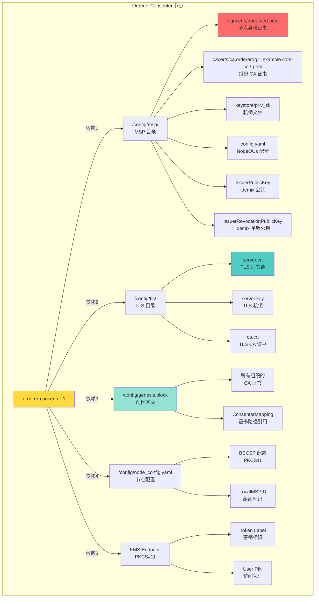
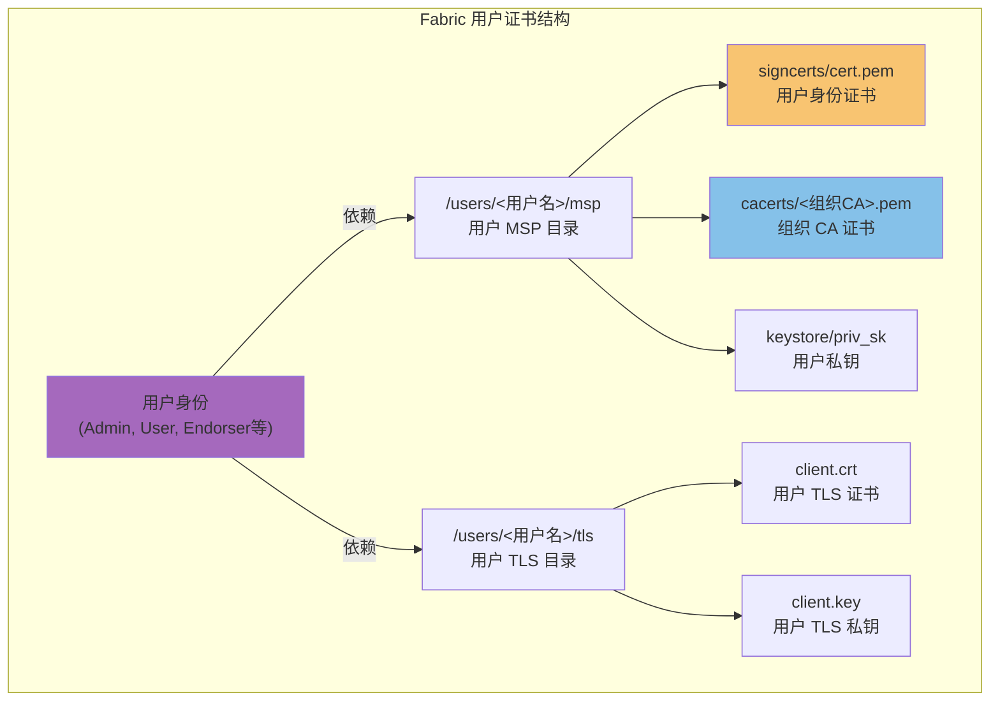
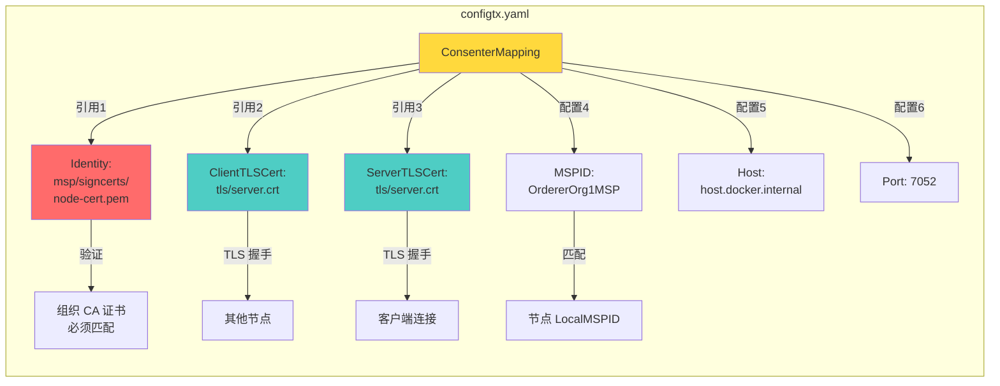
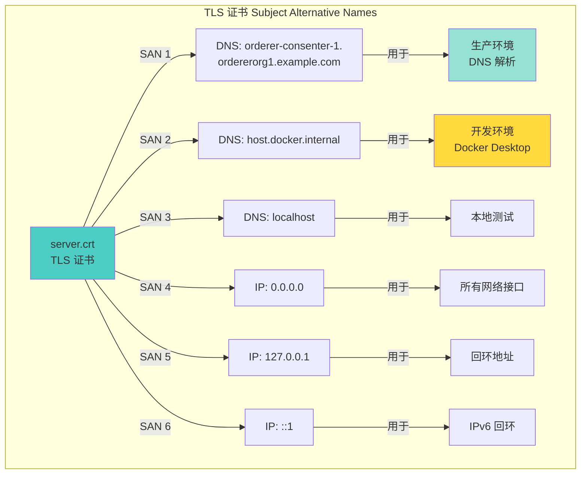

# 证书依赖关系及生产环境部署指南

## 1. 开发环境证书架构（当前实现）

### 1.1 单一 CA 架构



**问题：**
- ❌ 所有组织使用完全相同的 CA 证书（复制自同一个根CA）
- ❌ 无法实现组织间的信任隔离
- ❌ CA 私钥泄露影响所有组织
- ❌ 不符合生产环境安全要求

**关键区别：**
- 开发环境：`-->|生成|` 然后 `-.复制.-` 表示先生成根CA再复制给各组织（相同证书）
- 生产环境：`-->|生成|` 表示每个组织有独立的CA服务器

---

## 2. 生产环境证书架构（推荐）

### 2.1 多 CA 架构



**优势：**
- ✅ 每个组织独立的 CA 服务器
- ✅ 组织间真正实现信任隔离
- ✅ CA 私钥分散管理
- ✅ 符合生产环境安全要求

---

## 3. 证书依赖关系详细图



在当前开发环境中，所有组织证书均从此单一CA获取，这导致它们实际上是相同的证书。

---

## 4. 节点证书依赖树



## 4.1 用户证书依赖树



## 4.2 各类证书的作用

### 4.2.1 节点证书
- **Orderer节点证书**：用于共识排序服务，验证交易顺序
- **Peer节点证书**：用于账本维护和智能合约执行
- **Router节点证书**：用于消息路由
- **Batcher节点证书**：用于交易批处理
- **Consenter节点证书**：用于共识算法执行
- **Assembler节点证书**：用于区块组装

### 4.2.2 用户证书
- **Admin证书**：组织管理员，有权管理组织内的MSP配置
- **Channel Admin证书**：通道管理员，负责通道生命周期管理
- **Endorser证书**：背书节点，执行智能合约模拟并签署交易
- **Application Client证书**：普通应用用户，如User1@org1.example.com，用于与网络交互
- **在网络与Biz组件中的使用**：
  - 在 `cp_fabricx.sh` 脚本中，User1@org1.example.com 证书被复制到所有业务组件（issuer、auditor、retail、wholesale、endorser1）的 `keys/fabric/user/msp` 目录中
  - Endorser@org1.example.com 证书被复制到 `endorser1/keys/fabric/endorser/msp` 目录
  - Channel_admin@org1.example.com 证书被复制到 `endorser1/keys/fabric/admin/msp` 目录

### 4.2.3 CA证书
- **根CA证书**：网络信任根，验证所有其他证书的有效性
- **中间CA证书**：用于组织内部证书层次管理
- **TLS CA证书**：用于节点间通信加密

---

## 5. ConsenterMapping 证书引用



---

## 6. TLS 证书 SANS 配置



---

## 7. 生产环境配置建议

### 7.1 开发环境配置 (test-full-kms.yaml 示例)

```yaml
# 开发环境 - 单一 CA，简化部署
project_dir: ''
output_dir: ./out
channel_id: arma

# TLS configuration for orderer nodes
tls:
  enabled: false # 开发环境暂禁用 TLS 便于调试
  client_auth_required: false

# KMS configuration (开发环境示例)
kms:
  enabled: true
  endpoint: "host.docker.internal:50051"  # 开发环境 KMS 端点
  token_label: "FabricToken"              # KMS Token 标签
  ca_url: "http://host.docker.internal:7054" # 开发 CA URL

orderer_orgs:
  - name: OrdererOrg1
    domain: ordererorg1.example.com
    enable_organizational_units: false
    kms_token_label: "OrdererOrg1Token"   # 组织特定 Token
    kms_user_pin: "1234567"              # 组织特定 PIN
    orderers:
      - name: orderer-router-1
        type: router
        port: 7050
        host: host.docker.internal
      - name: orderer-consenter-1
        type: consenter
        port: 7052
        host: host.docker.internal
        user_pin: "individual-pin"         # 节点特定 PIN（可选）

peer_orgs:
  - name: Org1MSP
    domain: org1.example.com
    enable_organizational_units: false
    kms_token_label: "Org1Token"
    kms_user_pin: "1234567"
    peers:
      - name: peer0
    users:
      - name: Admin
      - name: channel_admin
        meta_namespace_admin: true
      - name: endorser
```

### 7.2 生产环境配置 (推荐)

```yaml
# 生产环境 - 分布式 CA，高安全级别
project_dir: ''
output_dir: ./out
channel_id: production-channel

# 启用 TLS 严格模式
tls:
  enabled: true                           # 生产环境启用 TLS
  client_auth_required: true              # 启用客户端身份验证

# KMS 配置（生产环境）
kms:
  enabled: true
  endpoint: "kms.production.net:50051"    # 生产环境专用 KMS 集群
  token_label: "production-fabric-token"  # 生产环境主 Token
  ca_url: "https://ca.production.net:7054" # 生产环境 CA 集群

orderer_orgs:
  # 每个 Orderer 组织部署独立的 Fabric CA
  - name: OrdererOrg1
    domain: orderer1.prod.corp          # 生产环境域名
    enable_organizational_units: true     # 启用 OU 验证
    kms_token_label: "orderer1-prod"     # 组织专属 KMS Token
    kms_user_pin: "${ORDERER_ORG1_PIN}" # 从环境变量获取敏感信息
    orderers:
      - name: orderer-router-1
        type: router
        port: 443
        host: router1.orderer1.prod.corp # 生产环境 FQDN
      - name: orderer-batcher-1
        type: batcher
        port: 444
        shard_id: 1
        host: batcher1.orderer1.prod.corp
      - name: orderer-consenter-1
        type: consenter
        port: 445
        host: consenter1.orderer1.prod.corp
      - name: orderer-assembler-1
        type: assembler
        port: 446
        host: assembler1.orderer1.prod.corp

  - name: OrdererOrg2
    domain: orderer2.prod.corp
    enable_organizational_units: true
    kms_token_label: "orderer2-prod"
    kms_user_pin: "${ORDERER_ORG2_PIN}"
    orderers:
      # 类似配置...

peer_orgs:
  - name: RetailBankMSP                 # 生产环境组织名称
    domain: retail.bank.prod.corp
    enable_organizational_units: true
    kms_token_label: "retail-bank-prod"
    kms_user_pin: "${RETAIL_BANK_PIN}"
    peers:
      - name: peer0
      - name: peer1
    users:
      - name: Admin
        # 生产环境应限制特权用户数量
      - name: TransactionAuditor
        meta_namespace_admin: true

  - name: WholesaleBankMSP
    domain: wholesale.bank.prod.corp
    enable_organizational_units: true
    kms_token_label: "wholesale-bank-prod"
    kms_user_pin: "${WHOLESALE_BANK_PIN}"
    peers:
      - name: peer0
    users:
      - name: Admin
```

### 7.3 KMS 集群配置

```yaml
# kms-cluster-config.yaml
clusters:
  - name: primary-kms
    endpoints:
      - kms-primary.prod.corp:50051
      - kms-secondary.prod.corp:50051
      - kms-tertiary.prod.corp:50051
    health_check_interval: 30s
    failover_timeout: 60s

  - name: backup-kms
    endpoints:
      - backup-kms1.dr-site.com:50051
      - backup-kms2.dr-site.com:50051
    health_check_interval: 60s

security:
  encryption_at_rest: true
  audit_logging: true
  compliance_standards:
    - pci_dss
    - soc2
    - iso_27001
```

### 7.4 CA 服务部署策略

```yaml
# ca-deployment-config.yaml
ca_deployments:
  # 每个组织独立部署 CA 服务
  - organization: OrdererOrg1
    ca_type: root_ca
    servers:
      - ca1.orderer1.prod.corp
      - ca2.orderer1.prod.corp
    replication:
      enabled: true
      sync_interval: 30s
    certificate_lifespan: 365d          # 证书有效期一年
    renewal_policy: rotate_every_180d   # 每180天轮换
    
  - organization: RetailBankMSP
    ca_type: intermediate_ca
    servers:
      - ca1.retail.bank.prod.corp
      - ca2.retail.bank.prod.corp
    parent_ca: root-ca.prod.corp
    certificate_lifespan: 180d
    renewal_policy: rotate_every_90d
    
  - organization: WholesaleBankMSP
    ca_type: intermediate_ca
    servers:
      - ca1.wholesale.bank.prod.corp
      - ca2.wholesale.bank.prod.corp
    parent_ca: root-ca.prod.corp
    certificate_lifespan: 180d
    renewal_policy: rotate_every_90d
```

---

## 8. 安全最佳实践

### 8.1 密钥管理
1. **HSM 优先**: 所有私钥必须存储在硬件安全模块(HSM)中
2. **密钥轮换**: 定期轮换 CA 证书和节点证书
3. **访问控制**: 严格的 KMS 访问策略和审计

### 8.2 证书管理
1. **组织隔离**: 每个组织维护独立的 CA 层次
2. **OU 验证**: 启用 NodeOUs 进行身份验证
3. **CRL 分发**: 部署证书撤销列表(CRL)分发点

### 8.3 网络安全
1. **TLS 1.3**: 使用最新版本 TLS 加密
2. **主机验证**: 严格验证 TLS 证书主机名
3. **防火墙**: 限制网络访问端口和服务

---

## 9. 部署指南

### 9.1 开发环境部署
 1. 使用单一 CA 配置快速搭建
 2. 采用 `test-full-kms.yaml` 模板
 3. 启用 `host.docker.internal` 以支持本地开发

### 9.2 生产环境部署
 1. 按组织独立部署 CA 集群
 2. 配置多级 CA 层次结构
 3. 部署 KMS 集群和监控
 4. 实施安全策略和审计

### 9.3 迁移路径
 - 从开发环境到生产环境的平滑迁移
 - 逐步增加安全级别
 - 有序引入组织隔离

---

